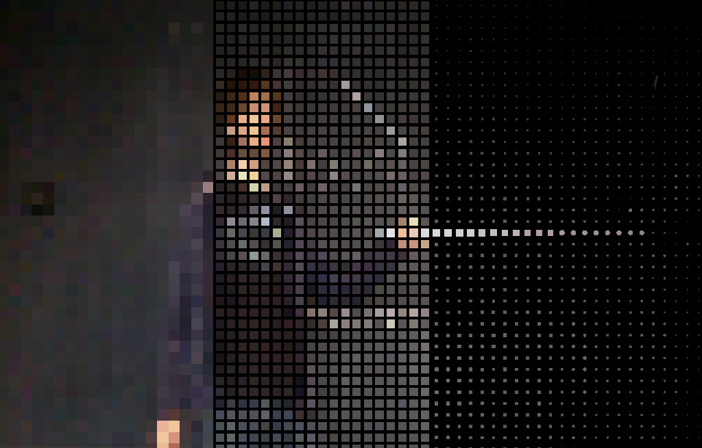

#ofxPointilize

filter addon to pixalize/pointilize images. Inspired by [ofxRetroPixel](https://github.com/Akira-Hayasaka/ofxRetroPixel) from [Akira Hayasaka](https://github.com/Akira-Hayasaka).

Compatible with openFrameworks 0.9.0+ 

Generate all project files using the openFrameworks Project Generator.

##Features

* takes an input texture and outputs a filtered texture
* parameters like pixel size or border size can be manipulated

 
##Sample Usage
see example project